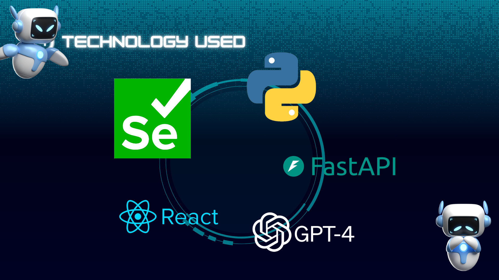
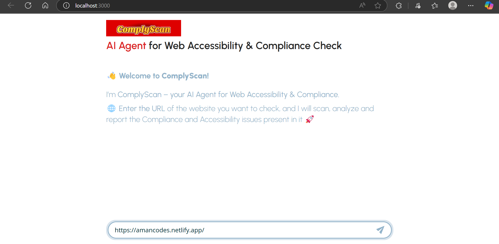
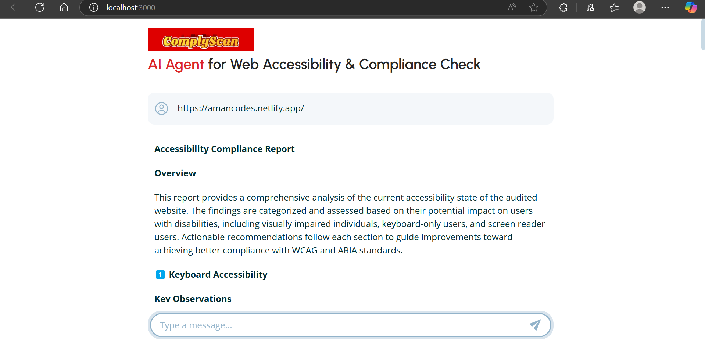
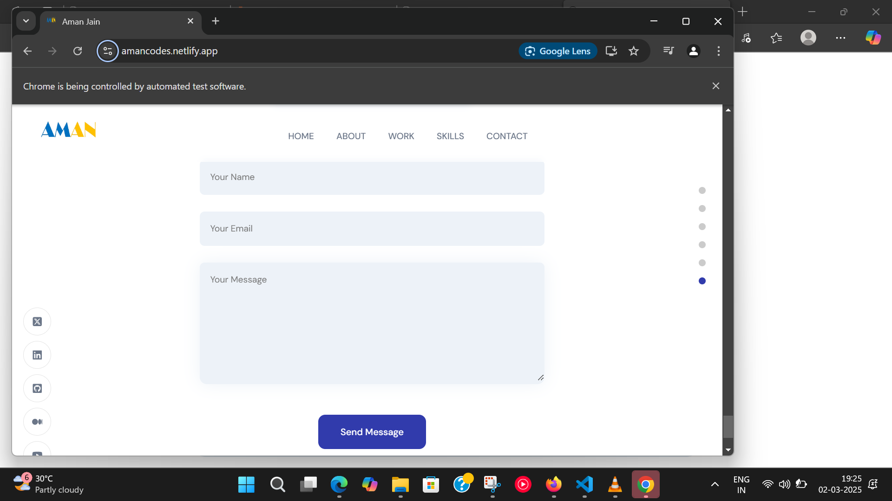
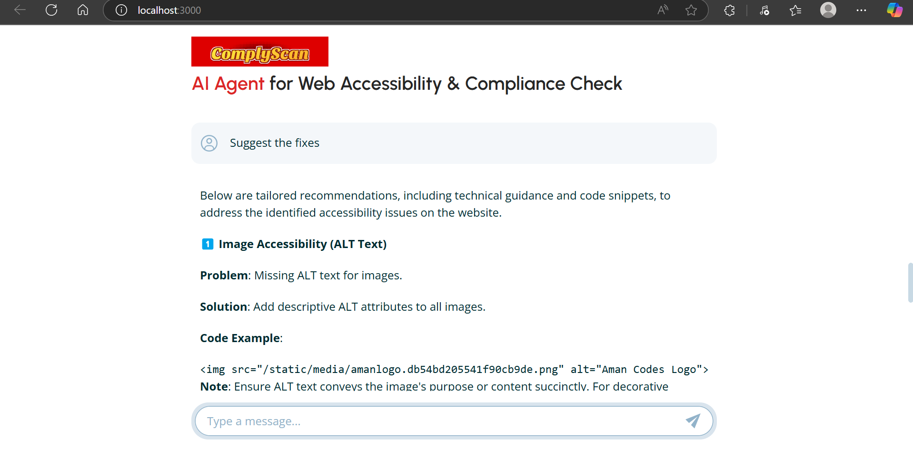

# 🚀 ComplyScan: AI Agent for Web Accessibility & Compliance Check

## 1️⃣ What is ComplyScan?

ComplyScan is an AI-powered agent designed to audit websites for accessibility, compliance, and usability issues.
It automatically scans any website for WCAG violations, ARIA attribute misuse, keyboard navigation problems, contrast issues, and more—then generates a detailed, human-friendly report powered by LLMs (Large Language Models).

Whether you're building for inclusivity or legal compliance, ComplyScan helps you spot and fix web accessibility gaps quickly.
## 2️⃣ Why is it Necessary?

⚠️ The web must be for everyone.
Millions of users depend on assistive technologies like screen readers and keyboard navigation to browse the web. Websites that ignore accessibility:

    Fail to meet legal standards (WCAG, ADA, Section 508).
    Risk lawsuits and financial penalties.
    Exclude users with disabilities, impairing user experience.
    Lose potential traffic and customers.

But manual audits are time-consuming and complex.
That’s where ComplyScan steps in with automated scanning, AI analysis, and actionable feedback.
## 3️⃣ Key Features 🛠️

✅ Detects keyboard navigation issues.
✅ Identifies missing alt texts, placeholders, labels, and ARIA roles.
✅ Checks contrast ratios for readability.
✅ Analyzes heading structures and semantic correctness.
✅ Extracts website main content and evaluates readability via LLMs.
✅ Verifies the presence of Privacy Policies, Cookies consent, and feedback links.
✅ Generates an AI-powered detailed report with context, issue descriptions, and recommendations.
✅ Supports ongoing conversations with the LLM to get tailored fixes and best practices.
4️⃣ Full Workflow 🔄

Here's how ComplyScan operates end-to-end:

    Input:
    You provide a website URL.

    Scanning:
        Selenium automates the browser and loads the page.
        Multiple accessibility checks run on the DOM:
            Identify interactive elements.
            Check for keyboard focus.
            Evaluate alt texts, ARIA roles, and attributes.
            Analyze color contrast ratios.
            Extract placeholders and labels.
            Detect heading levels and structure.
            Search for feedback/contact options and privacy policies.
            Gather the site's visible text content.

    Data Structuring:
    Results are compiled into a structured JSON object (final_results) that stores all detected violations and findings.

    LLM Analysis:
        The collected data is passed to an LLM with a specialized prompt.
        The LLM generates a detailed, readable report highlighting:
            Violations.
            Contextual explanations.
            Fixing strategies.
            Best practices.

    Further Interaction:
    Since LLM context is maintained, you can chat further with the system to ask for:
        Specific code snippets.
        Tailored recommendations.
        Deeper analysis of certain issues.

    Output:
        A comprehensive accessibility and compliance report.
        Optional AI-powered conversations to guide fixes.


[UI inspired from this repo.](https://codeawake.com/blog/ai-chatbot).

## Structure

The repository is organized into two main folders:

- `fastapi_backend/`: Contains the Python FastAPI backend code and a local Python version for testing.
- `frontend/`: Contains the React frontend code. It uses Vite.js as the build tool and bundler.

## Installation

### Prerequisites ✅

- Python 3.11+.
- Node.js 18+.
- Poetry (Python package manager).


### Backend

1. Navigate to the backend folder and install the Python dependencies using Poetry:

    ```bash
    cd fastapi_backend
    poetry install
    ```

2. Create a `.env` file in the backend folder copying the `.env.example` file provided and set the required environment variable:
    - `OPENAI_API_KEY`: Your OpenAI API key.
  
3. The application uses Pydantic Settings for configuration management. You can adjust the configuration defaults in `fastapi_backend/app/config.py`, or set the configuration variables directly using environment variables.

### Frontend

1. Navigate to the frontend folder and install the JavaScript dependencies:

    ```bash
    cd frontend
    npm install
    ```

2. Create a `.env.development` file in the frontend folder copying the `.env.example` file provided that includes the required environment variable:
    - `VITE_API_URL`: The URL to connect to the backend API.

3. Run the frontend

    ```bash
    npm run dev
    ```


### Full-Stack Application

To run the full-stack chatbot application:

   
1. Activate the virtual environment for the backend and start the backend server:

    ```bash
    cd fastapi_backend
    poetry shell
    fastapi dev app/main.py
    ```

2. In a separate terminal, start the frontend server:

    ```bash
    cd frontend
    npm install
    npm run dev
    ```


## Tech Stack


## Screenshots





## Demo Video
[Click here to watch](https://www.youtube.com/watch?v=EEOJOsmPxVQ)
